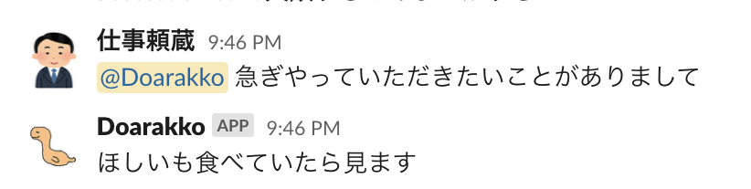

# yattoite

Slack bot that responds on my behalf on holidays using [freee 人事労務](https://www.freee.co.jp/hr).


This bot is created using Slack past messages and markov chain.

You can also use a CSV file instead of Slack comments.

## Requirements

- Slack
- freee API
- Docker
- docker-compose
- Heroku
  - Not required if run on local
- CSV file
  - Not required if use Slack comments

### Expected CSV format

| id  | body                                       |
| :-- | :----------------------------------------- |
| 1   | 私は天才エンジニアです。                   |
| 2   | お腹空き空き空き空き空きっ腹。寿司食うぞ。 |
| ... | ...                                        |

## Usage

### 1. Prepare code and create `.env` file

```sh
git clone https://github.com/Doarakko/yattoite
cd yattoite
cp .env.example .env
```

### 2. Create Slack app and enter environmental varialbes to `.env`

Easy to create using `manifest.yml`.

Get App-Level Token(`xapp-aaaa`) with `connections:write` and Bot User OAuth Token(`xoxb-bbbb`).

```
SLACK_APP_TOKEN=xapp-aaaa
SLACK_BOT_TOKEN=xoxb-bbbb
SLACK_USER_ID=ABCD01234
```

Get your user id on Slack by tapping your account and pressing "Copy link".

### 3. Create freee App

```
FREEE_CLIENT_ID=cccc
FREEE_CLIENT_SECRET=dddd
FREEE_CODE=eeee
```

For FREEE_CODE, enter the "認可コード" obtained by accessing the "Web アプリ認証用 URL" on the browser.

### 4. Get Slack comments

```sh
docker-compose up
docker exec -it app python scripts/create_table.py
```

`q` specifies the name of the channels from which to get the comments.

All channels containing `q` are included.
If you specify `times`, you can get it from `*times*`.

```sh
docker exec -it app python scripts/1_save_slack_comments.py <query>
```

Choose a user to create a bot.
User id is like `U0123abcd`.

```sh
docker exec -it app python scripts/2_select_slack_user.py <user id>
```

If you use the CSV file you have already prepared, skip it.

### 5. Preprocessing and make text file

You can specify the input and output file path by specifying the `-i` and `-o` options.(optional)

```sh
docker exec -it app python scripts/3_preprocessing.py -i data/<user id>_comments.csv
```

You can use `-min` and `-max` options to limit the size of the sentence you use.(optional)

If the `-min` is 6, then `我々4歳くらいです`(`我々 4 歳 くらい です`) is excluded.

```sh
docker exec -it app python scripts/4_make_sentences.py -i <input> -o <output> -min <minimum word count> -max <max word count>
```

### 6. Generate sentences

You can use `-s` to specify how many morphemes of the original sentence to use.

Larger will produce the correct sentece, but it's boring.

```sh
docker exec -it app python scripts/5_generate.py -i <input> -o <output> -n <count of generate sentences> -s <state size>
```

Let's enjoy tuning!

### 7. Insert records

```sh
docker exec -it app python scripts/6_insert.py
```

## Run on Heroku

Click "Deploy to Heroku" Button and enter your environment valiables.

[](https://heroku.com/deploy)

Get `DATABASE_URL` from "Settings/Config Vars" on Heroku dashboard.

On local enter the `DATABASE_URL`, other data create and insert methods are the same as the above local step.

## Hints

### Bot does not respond when you are working

```python
def message(say):
    ...

    if freee.is_working():
        return

    ...
    say(row.body)
```

### Make a rug without getting an immediate response

```python
def message(say):
    ...

    # camouflage to avoid being identified as a bot
    time.sleep(
        random.choice(
            [10, 20, 20, 30, 30, 30, 60, 60, 60, 180, 240, 300, 360, 420, 480, 540, 600]
        )
    )

    ...
```

### Make your bot's icon and name the same as your Slack account

If you look closely, it will be noticed if it is a bot depending on whether or not "App" is displayed.

Well, it'll be alright.


